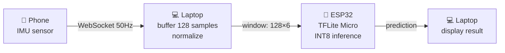

<div align="center">

# 📉 Gradient Smoothing for Stable TinyML Training

**EMA gradient smoothing → quantization-robust HAR models on ESP32**


Tribhuvan University · Purwanchal Campus, Dharan · Dept. of Electronics & Computer Engineering

</div>

---

## 📖 Table of Contents
- [Overview](#-overview)
- [Pipeline](#-pipeline)
- [Method](#-method)
- [Results](#-results)
- [Repo Structure](#-repo-structure)
- [Getting Started](#-getting-started)
- [Roadmap](#-roadmap)

## 🔍 Overview

Does **EMA gradient smoothing** ( g̃ₜ = β·g̃ₜ₋₁ + (1−β)·gₜ , β ∈ {0.7, 0.8, 0.9} ) make lightweight neural nets **easier to quantize** and **more stable to train**, on a **6-class Human Activity Recognition** task running live on an **ESP32**?

<details>
<summary><b>Why this matters (click to expand)</b></summary>

Sharper training minima quantize poorly. If gradient smoothing biases training toward flatter minima, INT8-quantized models should lose less accuracy — a real win for microcontroller deployment where every bit of accuracy after quantization counts.
</details>

## 🔗 Pipeline



Raw IMU windows (128 samples × 6 channels @ 50Hz) feed a **1D CNN** — replacing an earlier UCI-HAR/MLP baseline, which broke on live inference due to a sensor mismatch (UCI HAR was captured on a 2012 Galaxy S2).

## 🧮 Method

| Optimizer | β | Role |
|---|---|---|
| SGD | 0.7 | baseline |
| SGD + Momentum | 0.8 | classical comparison |
| **EMA-SGD** | 0.7 / 0.8 / 0.9 | gradient smoothing under test |

Each config evaluated over **5 seeds × 100 epochs**, tracking `grad_var` (gradient norm variance) and `val_loss_stability` (std of last 20 epochs' val loss).

## 📊 Results

<div align="center">

| Metric | Winner | Note |
|---|---|---|
| Test accuracy | EMA-SGD β=0.7 (95.51%) | best mean + most reproducible |
| Gradient variance | EMA-SGD (monotonic in β) | cleanest, strongest signal |
| Validation stability | SGD + Momentum | ⚠️ contradicts hypothesis |
| Quantization drop | Plain SGD | ⚠️ drop *increases* with β |


## 🚀 Getting Started

```bash
# 1. Collect data (phone → laptop)
python serve.py

# 2. Train + sweep optimizers
python train.py --config configs/ema_sweep.yaml

# 3. Quantize
# (INT8 post-training quantization — see tinygradsmooth_raw.ipynb)

# 4. Flash ESP32 and run inference
# (TFLite Micro firmware in esp32/)
```

## 🗺️ Roadmap

- [ ] Port optimizer sweep from MLP → 1D CNN pipeline
- [ ] Add Polyak–Ruppert weight averaging (distinct from EMA smoothing)
- [ ] Explore β-annealing as a report extension

---

<div align="center">
<sub>Minor Project · Dept. of Electronics & Computer Engineering · 4-member team</sub>
</div>
